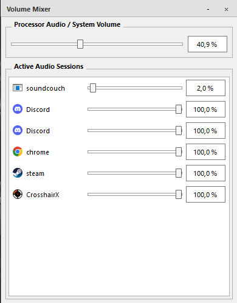

# VolumeManager

VolumeManager is a lightweight Windows audio control utility built with C++ and Qt. It provides quick access to your system volume and allows you to control the volume of individual applications from a simple interface.



## Features

* System-wide volume control
* Per-application volume management
* Automatic detection of active audio sessions
* System tray integration
* Lightweight and responsive Qt interface
* Installer-based setup (`VolumeManagerSetup.exe`)
* Runs quietly in the background
* Easy access through the system tray

## Installation

1. Download the latest release.
2. Run `VolumeManagerSetup.exe`.
3. Follow the installation wizard.
4. Launch VolumeManager.

After launching, VolumeManager automatically minimizes to the Windows system tray and continues running in the background.

## Usage

### System Volume

The top slider controls the master system volume of Windows.

### Application Volume

VolumeManager automatically detects active audio sessions and displays them in the application list.

For each application you can:

* Adjust its volume independently
* Monitor current volume levels
* Manage multiple running applications at the same time

### System Tray

When VolumeManager is running, an icon appears in the system tray.

From there you can:

* Open the main window
* Hide the application
* Exit VolumeManager

## Built With

* C++
* Qt Framework
* Windows Core Audio APIs

## Requirements

* Windows 10 or newer
* Audio device configured in Windows
* Administrator privileges may be required for certain audio operations or when installing the software using the installer

## Project Structure

```text
VolumeManager/
├── src/
├── include/
├── resources/
├── installer/
└── README.md
```

## Credits & Assets

### Application Icon

The volume/speaker icon used by VolumeManager is not owned by the author.

The icon is intended to resemble the familiar Windows audio icon for usability and recognition purposes. Any trademarks, copyrighted designs, or intellectual property associated with the original Windows audio icon remain the property of their respective owners.

VolumeManager is an independent project and is not affiliated with, endorsed by, or sponsored by Microsoft.

### Screenshot Notice

Applications shown in screenshots (such as Steam, Discord, Chrome, CrosshairX, and others) are examples of active audio sessions detected on the author's system and are not included with VolumeManager.

All application names, logos, icons, and trademarks belong to their respective owners.

## License

This project is licensed under the VolumeManager EULA.

See the [LICENSE](EULA.txt) file for full details.

## Contributing

Contributions, improvements, bug reports, and suggestions are welcome.

If you publish a fork or modified version, please clearly reference the official VolumeManager repository as required by the license.

## Disclaimer

This software is provided "AS IS" without warranty of any kind.

The author is not responsible for any damages, data loss, hardware issues, software issues, legal issues, or other consequences resulting from the use or misuse of this software.

## Author

GitHub: **yummyzzzz_**
